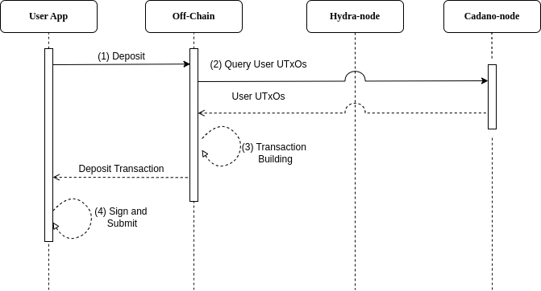
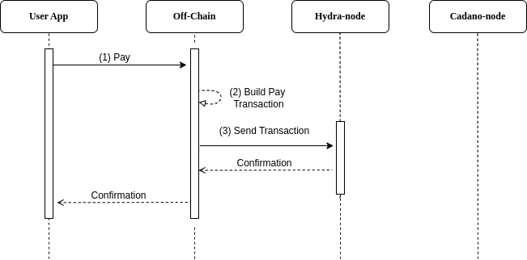
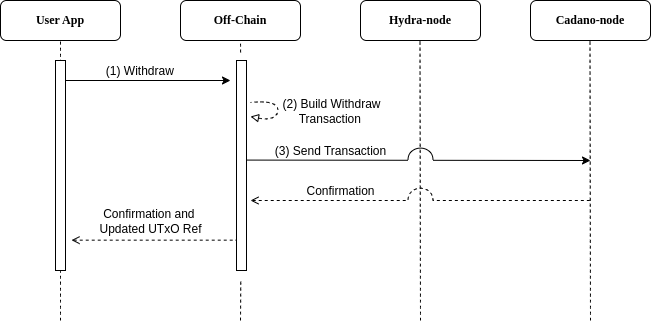
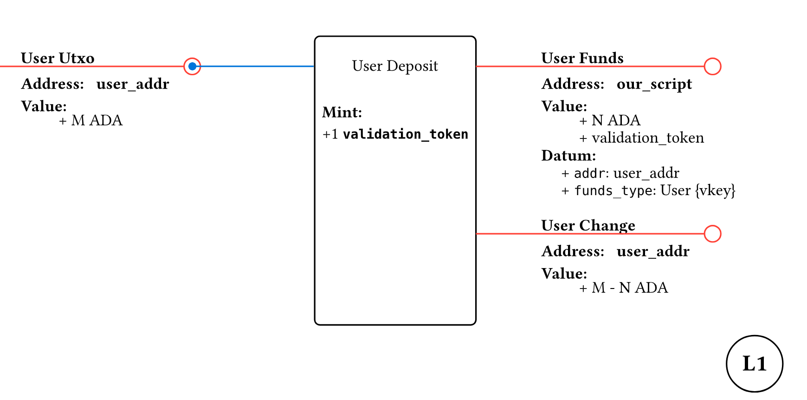
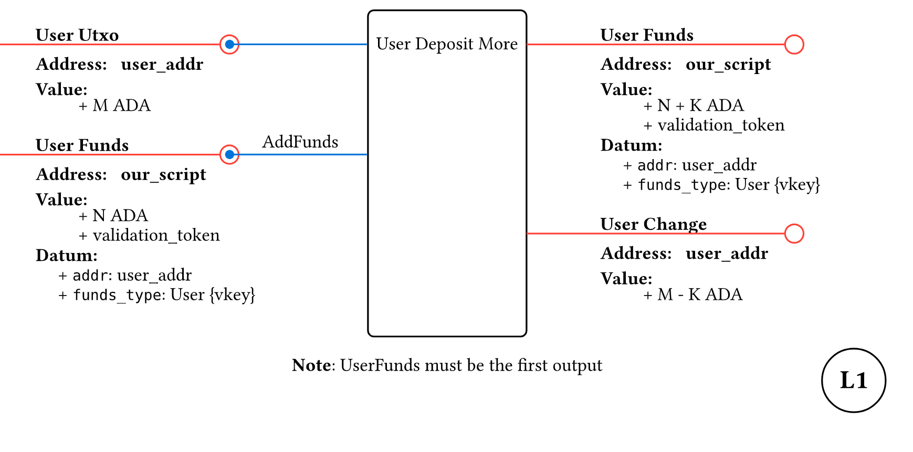
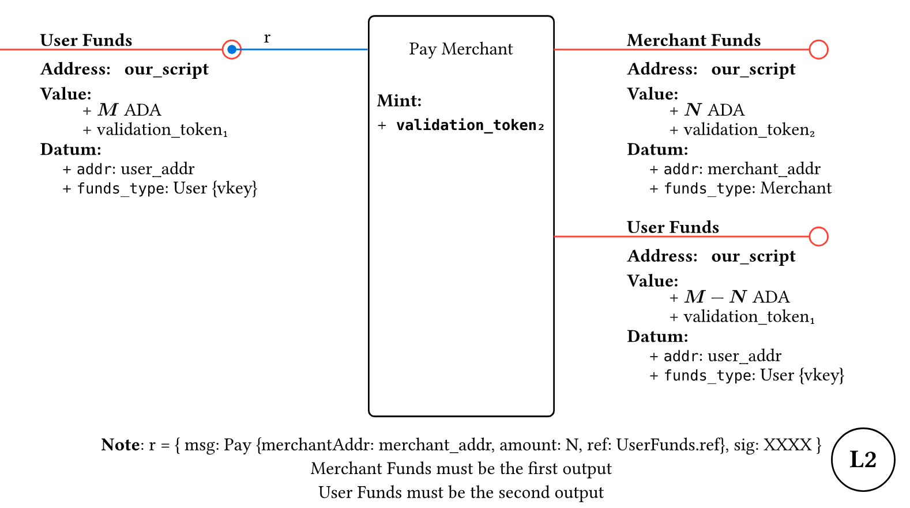
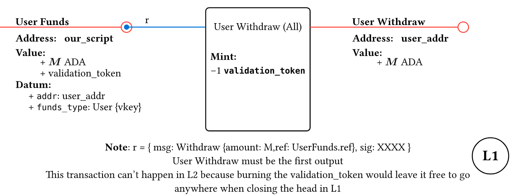
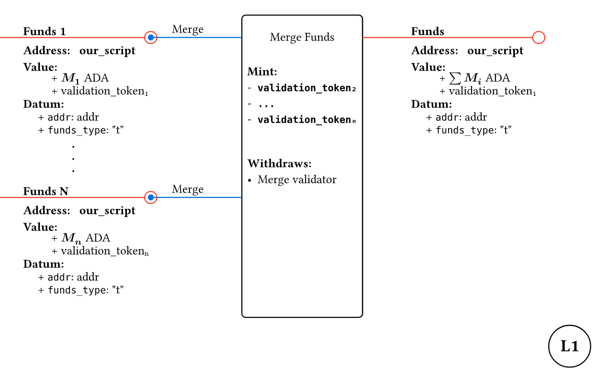

# Requirements and design

## Problem

Users want to spend their ADAs in the real world, but the Cardano transaction settlement times and costs make this impractical.

## Technical solution

To circumvent those limitations, we use a Hydra head where users can make payments that settle faster and cheaper. This head is managed by Blazar labs. Users can deposit their funds from L1 into the head, make payments to merchants and withdraw any remaining funds back to the L1.

The system will handle user requests, building transactions and querying the user balances for both the L1 and L2 chains. This solution involves opening and closing a new Hydra Head each day, to allow users to deposit funds into the system. This limitation can be lifted in a v2 of the protocol once [Incremental Commits](https://github.com/cardano-scaling/hydra/issues/199) are implemented. Incremental Decommits are available, so users and merchants can withdraw their funds at any time, although this feature is not part of the designed MVP. Merchant funds are aggregated into a single UTxO during the lifespan of the Hydra head and paid to their address at the end of each day. User funds not withdrawn will be committed into the new Hydra head. We also include a "merging" step, where multiple user deposits UTxOs can be merged into one to increase the amount of users that can fit into a single head.

The complete proposed flow looks like this:

- Users deposit their funds into an L1 smart contract
- Those UTxOs are consumed by the admin and committed into the hydra head
- Users can pay Merchants using the funds committed into the head
- Each Merchant will have at most one UTxO inside the hydra head, combining all the payments they received so far
- Users can also deposit more funds in the L1. But it won't be available until the current head is closed and the new head is open
- Users and Merchants can request a withdrawal at any moment, and the funds will be returned to them when the head closes.
- Once the day has ended, all Merchants UTxOs will be withdrawn. Meaning that the funds will leave the smart contract UTxO and go to their respective addresses, still in the L2
- Then, the head will close and fanout the User and Merchant UTxOs to the L1
- Before opening a new head, any deposit UTxOs that share the same User will be merged. Including new deposits and remaining funds from the previous head
- Now that every user has only one deposit UTxO in their name, a new head can be opened

## Use cases

### Use case: Deposit ADA

Context: A User has ADAs and wants to start using the protocol

- The backend receives a request with the user address, funds to deposit and user verification key (1)
- The backend queries the user UTxOs (2)
- The backend builds the transaction creating a script UTxO in L1 where the user funds will be stored (3)
- If the user already had a pending deposit in L1, the generated transaction will consume that UTxO as well, merging everything into one UTxO
- The backend returns the transaction CBOR, which the frontend/user wallet can sign and submit (4)

### Use case: Open the Hydra Head

Context: An Admin wants to collect User deposits and open the hydra head

- The backend receives a request to open the head
- The backend sends a request to the hydra-node to initialize a head (1)
- The hydra node builds and submits the Init transaction to the L1 (2&3)
- The backend queries the L1 chain and gets a list of all pending user deposits (4)
- The backend builds the merge transactions (5)
- The backend submits the merge transactions to the cardano node and waits for the confirmation (6)
- The backend builds a transaction consuming the user deposit UTxOs (7)
- The backend sends a Commit request to the hydra-node using the built transactions as a blueprint (8)
- The hydra node builds and submits the Commit transaction (9&10)
- The hydra node builds and submits the CollectCom transaction

### Use case: Query Funds

Context: A User or Merchant wants to know how much funds they have in the protocol

- The backend receives a request with the user or merchant address (1)
- The backend queries L2 and gets the funds UTxO and the withdraw UTxOs if any (2)
- The backend queries L1 and gets a list of user deposit UTxOs (3)
- The backend returns the amount of ADAs that are pending deposit, ready to use and pending withdrawal (4)

### Use case: Pay merchant

Context: A User wants to use their available funds to pay a Merchant

- The backend receives a request with the user address, merchant address, payment amount and user signature (1)
- The backend queries the User Funds UTxOs in the L2 (2)
- The backend builds an L2 transaction that spends the user funds UTxO and creates a Merchant UTxO (3)
- The backend sends the transaction to the hydra-node (4)
- The hydra node submits the transaction
- The backend returns a success or error message

### Use case: Withdraw User funds

Context: A User wants to withdraw ADAs from the protocol

- The backend receives a request with the user address, amount to withdraw and signature (1)
- The backend queries the L2 User Funds UTxOs (2)
- The backend builds an L2 transaction that spends the user funds UTxO and creates a new UTxO at the user address (3)
- The backend sends the transaction to the hydra node (4)
- The hydra node responds with the confirmation of the transaction
- The backend returns the confirmation and the updated User Funds

### Use case: Close the Hydra Head

Context: An Admin wants to close the hydra head for the day, preparing for the opening of a new head

- The backend receives a request to close the head
- The backend queries all Merchant Funds UTxOs from L2 (1)
- The backend builds and submits L2 transactions to withdraw all merchant funds (2&3)
- The backend sends a Close command to the hydra node (4)
- The hydra node builds and submits the L1 transaction to close the head (5&6)
- Once the contestation period has ended, the backed sends a Fanout command to the hydra node
- The hydra node builds and submits the L1 transaction to fan-out the head, opening new user funds UTxOs and sending merchant funds to their address
- The backend returns a success or error message

## Technical Details

For the implementation we propose using Aiken (Latest version being V1.1.3) for the on-chain validators and typescript with the Blaze library for the off-chain code and backend. In terms of infrastructure a Cardano Node is needed for querying and submitting transactions to L1, and a collection of hydra nodes to manage the hydra head.

### Hydra limitations

In this section we detail our findings and estimations regarding limits in different hydra-related operations. We reference this report from the hydra team as an upper bound for the transaction limits: <https://hydra.family/head-protocol/benchmarks/transaction-cost/>. In short, these are our estimations for each hydra operation:

|               | Commit | CollectCom | Fanout |
|---------------|--------|------------|--------|
| # Users/UTxOs | 12-14  | 60-84      | ~80    |

#### Commit Transaction

The commit transaction is the first critical point in the protocol. This is the L1 transaction where User Funds UTxOs are consumed and aggregated into the Hydra-commit script address. Our conservative estimation lies between 12 and 14 User Funds UTxOs that we can commit per party in the head. Our reasoning is explained below.

According to the reference document, the current limit is 20 ada-only UTxOs. With our testing, we were able to submit 18 script UTxOs with an "always true" validator (Transaction found [here](https://preprod.cexplorer.io/tx/827e53ad9ec2c8c960eae0f434305327ac63e751a472d9513de9f77ff6d74cb0)). The bottleneck becomes the memory units limit per transaction, so committing fully validated UTxOs would increase the memory usage and in-turn decrease the amount of UTxOs we can commit. This of-course can't be properly calculated until the validator is implemented, but we did another test with a simple script that has some of the simpler validations and got an upper-bound of 16 UTxOs (You can check out this tx [here](https://preprod.cexplorer.io/tx/f4c72d2370d40cba3883f99302c6559f8c83c9f064441590e83f8620b1e12628)). We reach our estimation of 12 to 14 by accounting for the rest of the validation that needs to be implemented.

#### CollectCom Transaction

Given the limit of 5 or 6 parties per CollectCom transaction described in the document, this would give us a theoretical user limit between 60 and 84 UserFunds UTxOs per head opening. By doing the Merge step on L1, we can directly relate each UTxO with a different user.

#### Fanout Transaction

The last bottleneck occurs in the Fanout step, the reference document lists a limit of around 80 ada-only UTxOs. Given our users estimate, this would give us at most 20 merchant UTxOs that can be generated on fanout, probably less considering that our UTxOs have tokens and datums. However, this can be worked around by decommiting the merchant UTxOs and even some User Funds UTxOs before closing the head to make the remaining UTxO set fit inside the limits. With the implementation of [Partial Fanout](https://github.com/cardano-scaling/hydra/issues/1468) this limitation can be easily overcome.

### Security of user funds

The delegated head architecture that will be used puts a lot of trust into the hands of the hydra nodes that run the head. If they all collude, they can override any smart contract logic and move funds without user consent. To mitigate security concerns the plan is to recruit SPOs to be part of the hydra head with their own hydra nodes and software. This gives users more assurance that their funds are secure, as there is no single party with enough power to execute an attack.

### Scalability

The MVP design described in this document doesn't make use of incremental commits and decommits. This means that to scale the protocol to more users, more heads need to be created. These heads would work independently from eachother, with a balancer system that would direct each users request to their respective head. There's a current limitation in the hydra node where each node can manage a single head. That makes management more difficult. When the hydra team implements [Multiple Heads per Node](https://github.com/cardano-scaling/hydra/issues/383), the architecture could be simplified.

Another way to support more users is to use Incremental Commits when they become available. This would be accompanied by the use of Incremental Decommits as well to let users and merchants withdraw their funds (As the head would never close under this v2 design). Given that commiting and decommiting are congestive operations, a batcher system would need to be implemented. With this system users and merchants can place commit/decommit orders and an authorized party can process a collection of orders in the same transaction. Even then, there can be a situation where the amount of users wanting to commit and decommit become unmageable by a single head and more need to be opened. Exact limits would need to be studied in more detail.

## Script UTxO

### Datum

- address: Address
- locked_deposit: Int
- funds_type: User {public_key: VerificationKey} | Merchant

### Value

- minAda ADA
- validation_token

## Transactions

While all transactions can technically occur in L1 and L2, we have added an indicator to each diagram to represent in which layer each transaction is designed to happen according to the proposed solution.

### User Deposit

### Commit Funds

### Pay Merchant

### User Withdraw

### Merge Funds

## Validations

### Spend validation

Validates the spending of user and merchant funds

For the **AddFunds** redeemer, the validations are the following:

- Continuing output is the first output
- Datum doesn't change
- Address doesn't change
- Validation token is present in the input
- Validation token is present in the output
- Lovelace amount in the value increases by at least N (N can be a parameter or decided later, to discourage DDOS attack)
- Value doesn't include any other AssetClass

For the **Commit** redeemer, the validations are the following:

- Has User funds_type
- Commit withdraw validator is run

For the **Pay** redeemer, the validations are the following:

- The msg and signature from the redeemer validate against the user vkey stored in the datum
- The ref stored in the redeemer msg is being spent
- The script UTxO being validated has User funds_type
- The msg and signature in the redeemer are valid considering the vkey of the User in the datum
- At most, one other input at the script address is present. This input is considered the Merchant Funds input
- If present, the Merchant Funds input has the Merchant funds_type (CAN WE PAY TO ANOTHER USER?)
- If present, the Merchant Funds input has the same address than the merchantAddr passed by redeemer
- If present, the Merchant Funds input has the validation token
- If present, the Merchant Funds input is being consumed with the AddFunds redeemer
- The first output is the Merchant Funds output
- The amount of lovelaces of the Merchant Funds output is the same as the amount specified in the Pay redeemer plus the Merchant Funds input (If present)
- The Merchant Funds output has the validation token
- The second output is the Remaining User Funds UTxO
- It must have at least the original amount of lovelaces minus the amount specified in the redeemer
- Remaining User Funds datum must be the same as User Funds UTxO
- Remaining User Funds address must be the same as User Funds UTxO

- If there's no Remaining User Funds, the validation token must be burnt
- If there's no Merchant Funds input, a new validation token must be minted

For the **Withdraw** redeemer, the validations are the following:

- If the funds_type is User, the msg and signature from the redeemer must validate against the user vkey stored in the datum
- If the funds_type is User, the ref stored in the redeemer msg must be spent
- The withdraw validator is run with the Withdraw redeemer

For the **Merge** redeemer, the validations are the following:

- The Merge withdraw validator is run

### Withdraw validator

Validates the actions that contain multiple script inputs interacting together

For the **Commit** redemeer the validations are the following:

- There's a single input that has the Hydra Init script address
- The redeemer of the Hydra Init UTxO is the list of utxo refs of all inputs from out script address
- The transaction is signed by the blazar admin

For the **Merge** redeemer the validations are the following:

- All inputs at the script address have the same datum
- There's more than one script input
- There's only one output at the script address
- The datum of the output is the same as all the inputs
- The output has the sum of all lovelaces of the inputs
- The output has one validation token
- All other validation tokens are burnt

For the **Withdraw** redeemer the validations are the following:

- For each script input check that:
  - There's an output whose address is the same as the address stored in the datum of the input
  - The value contains at least the amount of lovelaces specified in the redeemer
  - The value doesn't contain any other tokens
  - If there's leftover lovelaces, the next output must be the User Funds output
  - If present, the User Funds output must have at least the leftover lovelaces and the validation token
  - If present, the User Funds output must not have any other tokens
  - If present, the User Funds output must have the same datum as the input
  - If there's no leftover lovelaces, the validation_token must be burnt

### Minting Policy

Validates that the Funds UTxOs are created correctly.

The validations are the following when **minting**:

- The minted token is paid to the script address
- Only one token is being minted
- The token name is the same as the UTxO ref passed by redeemer
- The UTxO ref passed by redeemer is being consumed
- The value where the validation token is being paid only contains the token and lovelaces

And the following when **burning**:

- Always allow burning, as long as no tokens are being minted under this policy. (delegate the validation to the spend and withdraw purposes)
